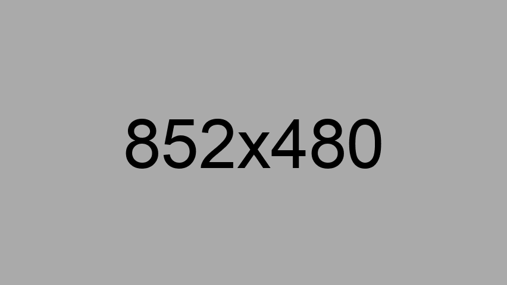

# <samp>OVERVIEW</samp>

Create your GitHub projects.



Maecenas id metus nisl. Donec iaculis sollicitudin enim, facilisis accumsan orci posuere sed. Nunc in ante sit amet mauris volutpat suscipit quis in leo. Morbi non felis dictum, maximus neque ac, pellentesque dui. Vestibulum tincidunt velit nec tempor suscipit. Sed feugiat ante quis urna finibus porttitor. Donec turpis metus, condimentum sed erat ac, mollis porttitor neque. Sed eget massa non lectus dapibus feugiat sit amet ut ligula. Aliquam imperdiet euismod urna in fermentum.

# <samp>GUIDANCE</samp>

### Create Angular Project

```shell

```

### Create GitHub Profile

```shell

```

### Create Monorepo Project

```shell

```

### Create React Project

```shell

```

### Create Vue Project

```shell

```
